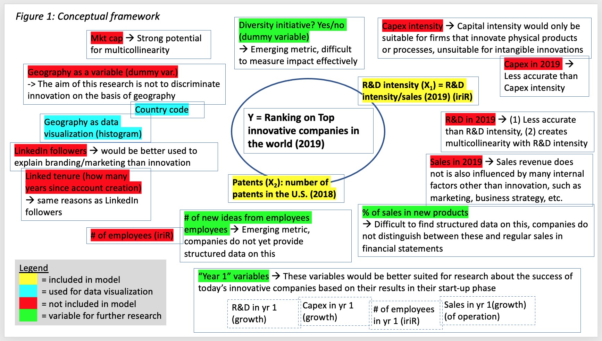
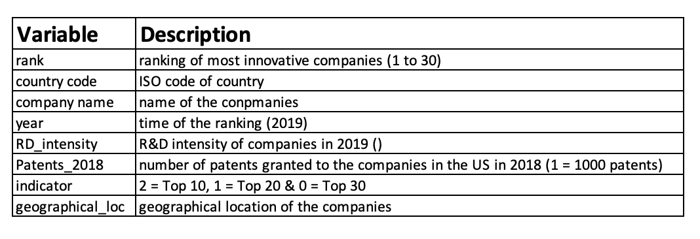
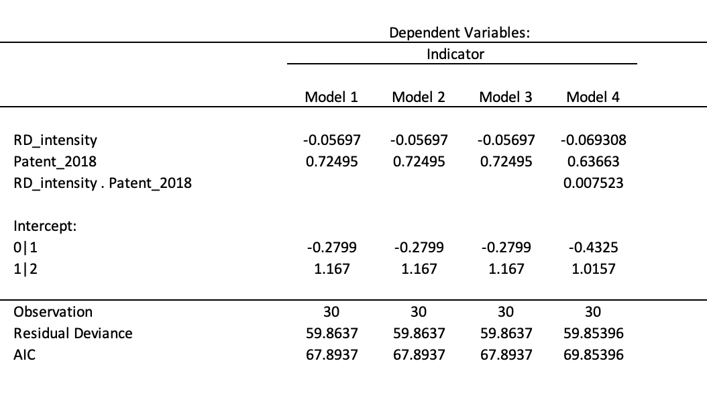

```{r setup, include=FALSE}
knitr::opts_chunk$set(echo = FALSE)
```

## Outline

- Introduction
- Research Question 
- Variables
- Models
- Discussion
- Conclusion

## Introduction
 
- Innovation has for a long time been serves as a driver for long term economic growth and development. However, variables that explain how companies are ranked on global innovation rankings remain a debatable subject. 

- For that reason, our research aims provide clarity to this debate and better understand the metrics that lead to innovation and firms' positions on innovation rankings.


## Literature
During the literature review, we identifies several metrics to measure innovation within companies:
 
*Conventional Metrics*:

- Patents

- R&D (R&D spending, R&D intensity)
 
*Emerging metrics*: 

- Subjective surveys

- Market cap

- Serving end users with innovations & other metrics
 
## Research Question

"What is the Impact of number of patents granted in the U.S. and R&D intensity on the ranking of the Top 30 innovative companies"

## Conceptual framework


## Variables

{width=100%}


## Models: Ordinal Logistic Regression

In an ordinal logistical regression, the output is the **Odds** of the a giving possible outcome as demonstrate in the following formula: 
 $$logit(P(Y<i))= \beta_0 - \beta_1.x_1-\beta_2.x_2-\beta_3.x_3-\epsilon$$
 
Checking for quadratic effect and interraction in variables:

- Model 1: $logit(P(indicator))=\beta_0-\beta_1.RD-\beta_2.patent$
- Model 2: $logit(P(indicator))=\beta_0-\beta_1.(RD)^2-\beta_2.patents$
- Model 3: $logit(P(indicator))=\beta_0-\beta_1.RD-\beta_2.(patents)^2$
- Model 4: $logit(P(indicator))=\beta_0-\beta_1.RD-\beta_2.patents-\beta_3.(RD.patents)$

## Results in R




## Estimates

The estimates function for model 1 is the following: (Y = 2 for "Top 10", 1 for "Top 20" and 0 for "Top 30"):

- $P(Y<1)=-0.2799-(-0.05697).RD-0.72495.patents$ 

- $P(Y<2)=1.167-(-0.05697).RD-0.72495.patents$

The estimates function for model 4 is the following: (Y = 2 for "Top 10", 1 for "Top 20" and 0 for "Top 30"):

- $P(Y<1)=-0.4325-(-0.069308).RD-0.63663.patents-0.007523(RD.patents)$

- $P(Y<2)=1.0157-(-0.069308).RD-0.63663.patents-0.007523(RD.patents)$

## Interpretation 
Since model 1,2 & 3, AIC score is lower than model 4's (**67.8637** < **69.85396**), therefore any of the first 3 model can be consider as the "best" model

**With this knowledge, the following statements can be made:**

- For every one unit increase in R&D intensity, the odds of being in the upper rank  (top 10 or top 20  versus top 30) is multiplied **0.06** (1-0.94)times, holding constant all other variables.

- For every one unit increase in patent, the odds of being in the upper rank (top 10 or top 20 versus top 30) is multiplied **2.06** times, holding constant all other variables.

## Discussion

- In addition to our reseach question, we have run a research to understand the state of art of the initiatives that could foment innovation and help the countries push up their companies on this list. 

- Our findings show as the main important constructs to be considered: The Triple Helix Theory, Diversity incentive, and Open Innovation adoption

##
**The Triple Helix Theory**

- Refers to the university–industry–government triad, the interaction between these parties is at the core of innovation and growth in increasingly knowledge-based societies


##
**Diversity incentive**
Studies have shown that: 

- eliminating the patenting gap of female holders of science and engineering degrees would increase gross domestic product (GDP) per capita by 2.7%

- including more women and African Americans in the initial stage of the innovation process would increase GDP between 0.64 and 3.3% per capita

##
**Open Innovation adoption**

- OI represents a shift from that old industry practice, driven by the new increasing opportunities to collaborate with external partners and individuals to find new innovative ideas. Some countries such as the USA, Australia and Singapore established open innovation policies at the national level to leverage an innovation culture.


## Conclusion

Our findings are a step in the right direction when answering our initial question.

- R&D intensity and patents are considered as closed innovation and this research highlights the need for metrics that measure the effect of open innovation, as well as government support and diversity initiatives.

- Such metrics can potentially capture the true essence of innovation and provide insights as to how firms can rise in innovation rankings and how countries can foster innovation to drive economic growth.

## Limitations & Further research

Project limitations:

- Our sample size is statistically significant, but not large enough to make generalizations
- our sample is not a accurate representation of the population since most of the companies are large and U.S firms

Further research:

- create models using more than two variables to explain innovation
- use panel data to evaluate the changes in company rankings over time
- define metric for open innovation and incorporate them to the model creation


