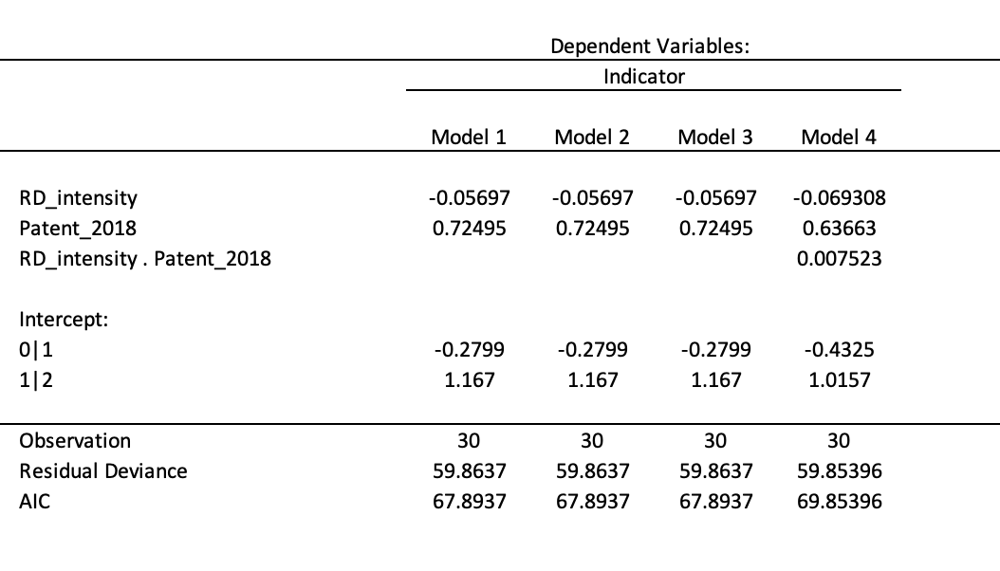

```{r setup, include=FALSE}
knitr::opts_chunk$set(echo = FALSE)
```

## R Markdown

- Introduction
- Research Question 
- Varibles
- Results
- Discussion
- Conclusion


## Introduction


## Research Question

"What is the Impact of number of patents granted in the U.S. and R&D intensity on the ranking of the Top 30 innovative companies"

## variables

{width=60%}


## Models

- In an ordinal logistical regression, the output is the **Odds** of the a giving possible outcome as demonstrate in the following formula: 
 $$logit(P(Y<i))= \beta_0 - \beta_1.x_1-\beta_2.x_2-\beta_3.x_3-\epsilon$$

- final_filtered_data <- final_filtered_data %>% mutate(indicator = case_when(indicator == "top 10" ~ 2, indicator == "top 20" ~ 1, TRUE ~ 0))

## Models

- Model 1: $logit(P(indicator))=\beta_0-\beta_1.RD-\beta_2.patent$
- Model 2: $logit(P(indicator))=\beta_0-\beta_1.(RD)^2-\beta_2.patents$
- Model 3: $logit(P(indicator))=\beta_0-\beta_1.RD-\beta_2.(patents)^2$
- Model 4: $logit(P(indicator))=\beta_0-\beta_1.RD-\beta_2.patents-\beta_3.(RD.patents)$

## R result



## Interpretation 
Since model 1,2 & 3, AIC score is lower than model 4's (**67.8637** < **69.85396**), therefore any of the first 3 model can be consider as the "best" model

**With this knowledge, the following statements can be made:**

- For every one unit increase in R&D intensity, the odds of being in the upper rank  (top 10 or top 20  versus top 30) is multiplied **0.06** (1-0.94)times, holding constant all other variables.

- For every one unit increase in patent, the odds of being in the upper rank (top 10 or top 20 versus top 30) is multiplied **2.06** times, holding constant all other variables.

## Slide with Plot

```{r pressure}
plot(pressure)
```

