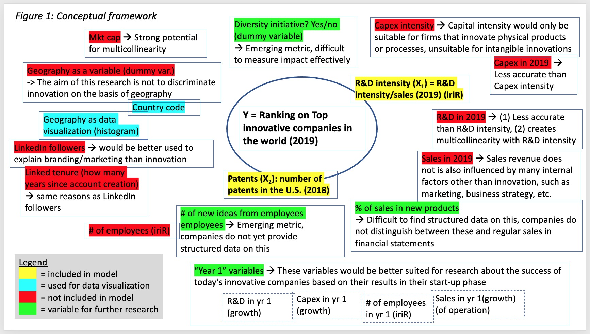

```{r setup, include=FALSE}
knitr::opts_chunk$set(echo = FALSE)
```

## R Markdown

- Introduction
- Research Question 
- Varibles
- Model
- Discussion
- Conclusion


## Introduction
During the literature review, we identifies several metrics to measure innovation within companies:
- Conventional Metrics: Patent and R&D
- Emerging metrics: Survey, Market cap and Serving end users with innovations & other metrics

## Research Question

"What is the Impact of number of patents granted in the U.S. and R&D intensity on the ranking of the Top 30 innovative companies"

## Conceptual framework


## variables

{width=100%}


## Models

In an ordinal logistical regression, the output is the **Odds** of the a giving possible outcome as demonstrate in the following formula: 
 $$logit(P(Y<i))= \beta_0 - \beta_1.x_1-\beta_2.x_2-\beta_3.x_3-\epsilon$
 
Checking for quadratic effect and interraction in variables:

- Model 1: $logit(P(indicator))=\beta_0-\beta_1.RD-\beta_2.patent$
- Model 2: $logit(P(indicator))=\beta_0-\beta_1.(RD)^2-\beta_2.patents$
- Model 3: $logit(P(indicator))=\beta_0-\beta_1.RD-\beta_2.(patents)^2$
- Model 4: $logit(P(indicator))=\beta_0-\beta_1.RD-\beta_2.patents-\beta_3.(RD.patents)$

## R result


## Interpretation 
Since model 1,2 & 3, AIC score is lower than model 4's (**67.8637** < **69.85396**), therefore any of the first 3 model can be consider as the "best" model

**With this knowledge, the following statements can be made:**

- For every one unit increase in R&D intensity, the odds of being in the upper rank  (top 10 or top 20  versus top 30) is multiplied **0.06** (1-0.94)times, holding constant all other variables.

- For every one unit increase in patent, the odds of being in the upper rank (top 10 or top 20 versus top 30) is multiplied **2.06** times, holding constant all other variables.

## Discussion

- In addition to our reseach question, we have run a research to understand the state of art of the initiatives that could foment innovation and help the countries push up their companies on this list. 

- Our findings show as the main important constructs to be considered: The Triple Helix Theory, Diversity incentive, and Open Innovation adoption

##

**The Triple Helix Theory**

##
**Diversity incentive**
Studies have shown that: 

- eliminating the patenting gap of female holders of science and engineering degrees would increase gross domestic product (GDP) per capita by 2.7%

- including more women and African Americans in the initial stage of the innovation process would increase GDP between 0.64 and 3.3% per capita

##
**Open Innovation adoption**

- OI represents a shift from that old industry practice, driven by the new increasing opportunities to collaborate with external partners and individuals to find new innovative ideas. Some countries such as the USA, Australia and Singapore established open innovation policies at the national level to leverage an innovation culture.

