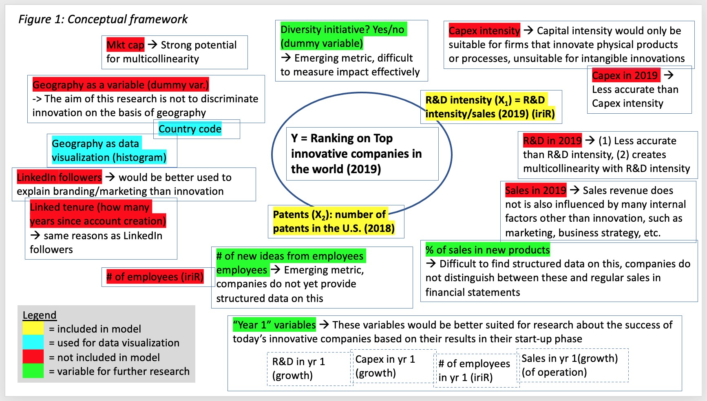
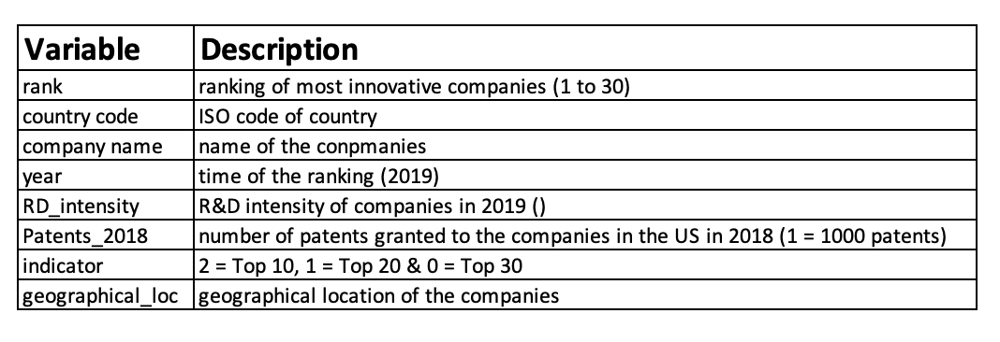
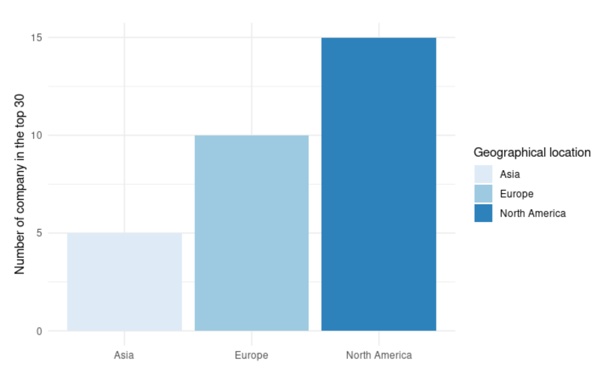
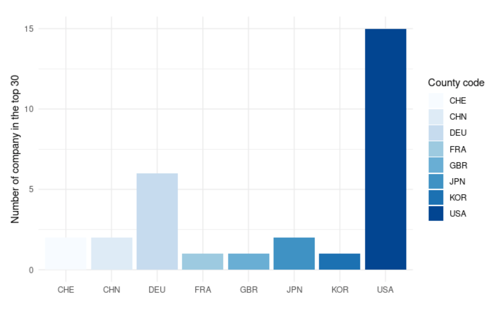
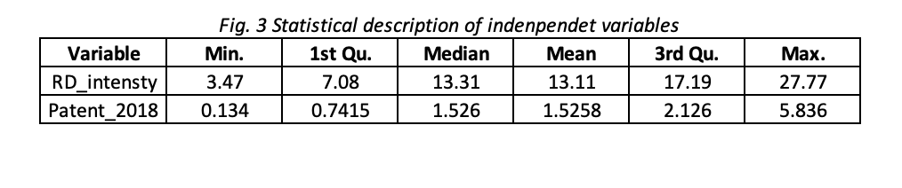
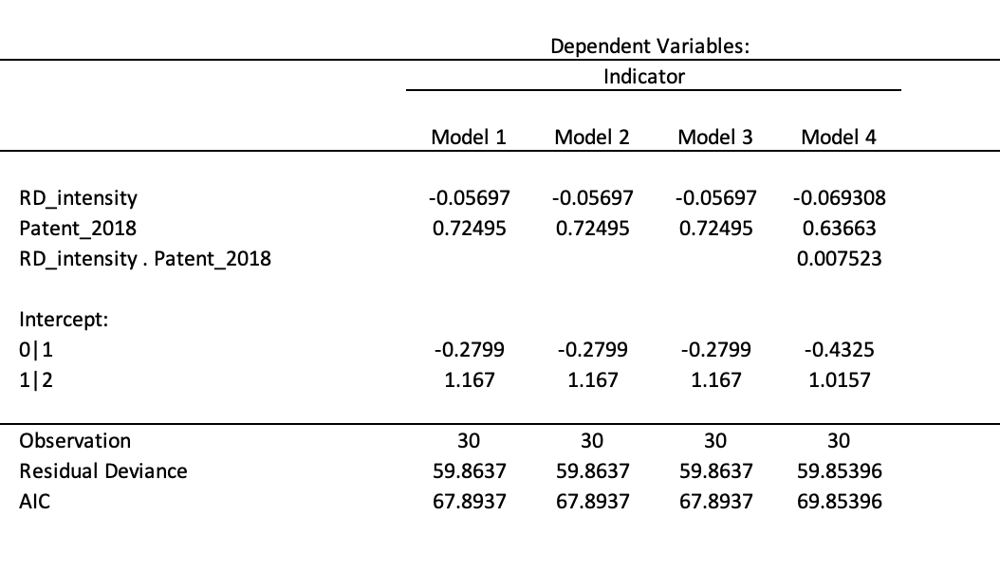
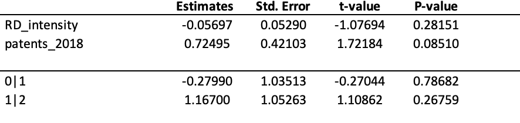
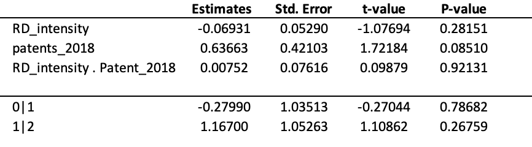
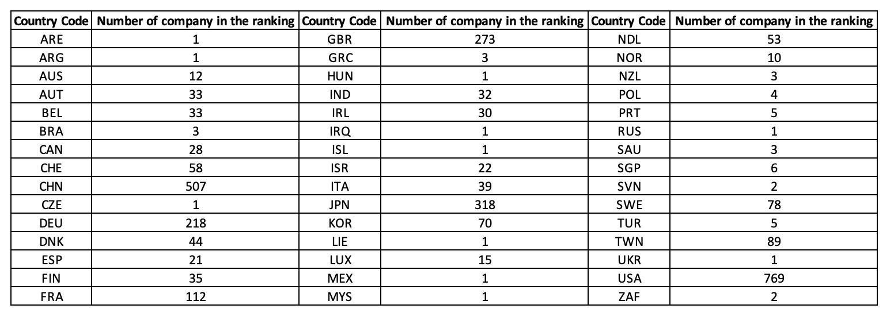

```{r setup, include=FALSE}
knitr::opts_chunk$set(echo = TRUE)
```
<div style="text-align: justify">
## Introduction
 

 
 
 
## Literature review
 
The body of literature identifies several metrics to measure innovation within companies. However, these metrics are only proxies, and do not fully capture in an exhaustive manor the true essence of innovation. Hence, different metrics capture different aspects of innovation and the literature offers confounding results as to which metrics are most effective for measuring innovation and ranking firms in terms of innovation.
 
### Conventional Metrics
 
#### *R&D and patents*
 
Historically, the most common metrics for innovation have been investments in research and development (R&D) and patents. Early on, R&D spending proved ineffective as a metric "after showing year over year that there [was] no statistically significant relationship between R&D spending and financial performance" (strategy&; as cited by ICSB, p.1, 2015). As a result, R&D intensity (i.e. firm R&D expenditures divided by sales) and patents are currently more widely used as proxies for innovation (Ferreira, 2010; Gallego-Alvarez, 2011; as cited by ICSB, p.1, 2015; CFO Innovation Asia, p.1, 2018).
 
However, studies present contradicting results on the impact of R&D on innovation. A study by Baumann and Kritikos found that "predicted R&D intensity is positively correlated with the probability of reporting innovations" (Baumann & Kritikos, p.1, 2016). They also found that R&D intensity is higher for smaller firms, thus raising their probability of reporting innovation (Baumann & Kritikos, p.1, 2016). In contrast, research conducted by the Internal Council for Small Businesses found a negative correlation betwen R&D intensity and innovation ranking, and warned of the potential pitfalls of continuing to use this metric, along with patents, as a proxy for innovation (ICSB, p.4, 2015).
 
As regards patents, contradicting results were also found. In a recent study, Esteves & Feldmann found a negative correlation between innovation and patents, "in other words, one may conclude that patents are not the most relevant indicator linked with the development of innovation" (Esteves & Feldmann, p.63, 2016). Research by the ICSB support this by also finding little to negative correlation between patents and innovation (ICSB, p.1, 2015). These findings contradict conventional wisdom---that patents represent innovation---and allude to the two-sided nature of patents: On one side, patents demonstrate that firms have developed new products or services through innovation. On the other hand, once patents are filed, patent-holding firms are temporarily protected from competition and therefore no longer have an incentive to innovate thereafter, which would explain the negative correlation with innovation, and a decline in innovation rankings.

### Emerging metrics
 
#### *Surveys*
 
In response to the contradicting results from studies on R&D intensity and patents, *strategy&*, a management consulting company, implemented a new innovation system based "not on any proxy metric, but rather based on a subjective study of the Global Innovation 1000 survey respondents to name the top-10 companies they thought were the world's most innovative (strategy&, 2015; as cited by ICSB, p.1, 2015). This method aims to avoid the pitfalls of conventional innovation proxies, proxies which fail to capture the true essence of innovation. This new method also favors the use of qualitative rather than quantitative measurements, relying on the judgement of individuals.
 
#### *Market cap*
 
The literature has also identified market capitalization as an emerging and insightful metric for measuring innovation and a firm's position on innovation rankings. Results from the ICSB study describe a strong correlation between the innovation ranking of companies and their 4-year percent change in market capitalization (ICSB, p.1, 2015). The study posits that these findings support the view that "the market rewards true innovation" (ICSB, p.3, 2015). This view is supported by Dyer and Gregersen (2015), who posit that "companies are ranked by their innovation premium: the difference between their market capitalization and a net present value of cash flows from existing businesses". However, this ranking only considered companies from industries with sizeable investments in R&D (Dyer & Gregersen, 2015), which suggest that R&D remains an important consideration.
 
#### *Serving end users with innovations & other metrics*
 
Moreover, research by Belkhir & Mathew (p.269, 2018) has identified "serving end-user needs with service innovations" as a superior metric to R&D intensity and patents. These findings rest on the notion that the innovation rankings of firms are based less on the magnitude of innovation, as measured by R&D figures, but rather by business performance on complex product & service offerings (Belkhir & Mathew, p.283, 2018). Other compelling metrics for innovation rankings recommended by the ICSB are the number of ideas submitted by employees and the percentage of sales coming form products developed in the last year (ICSB, p.1, 2015). The former alludes to human capital as being an internal source for innovation where diverse employees with innovative ideas can lead to firm innovation.
 
 
 
## Selection of Variables
 
As mentioned, the purpose of this research is to better understand which factors lead to innovation and the rise in a company's innovation ranking by using quantitative methods. Rather than exploring many variables with little depth, this study will explore few variables in greater depth to more thoroughly understand their impact on innovation rankings. Hence the study will focus on only two variables, selected from the literature review and initial datasets.
 
As stated, the literature shows that *market cap* is positively correlated with innovation and researchers posit that "the market rewards true innovation" (ICSB, p.1, 2015). However, we disagree in part with this claim for several reasons. Firstly, history has shown that companies, such as oil companies and banks, can be rewarded on the stock market without truly innovating (market cap attributed to oligopoly or monopoly power). Secondly, change in market cap is also heavily influenced by changes in the market concentration of a company's industry, supply and demand for the company's stock, accounting returns, investor sentiment, behavioural aspects, economic conditions and the overall performance of market indicies, to name a few. It is very difficult to control for all of these variables and be left with the effect of innovation alone.
 
Futhermore, market cap may be subject to multicollinearity, where a firm might have a higher market cap because of the number of patents it holds. This multicollinearity would make it nearly impossible to compare the significance of market cap and patents on innovation respectively, since the effect of patents is would be present in market cap. In short, market cap is a complex metric that involves many sub-dimensions and thus will not be the focus of this study.

As regards *serving end-users with service innovations*, this variable is also difficult to measure. This metric can be interpreted as being highly dependent on the position of the firm's activities in the value chain (upstream/downstream) and proximity to the end user rather than the firm's contribution of added value towards a final product. In addition, this metric is difficult to qualtify, and align better with a quantitative-qualitative approach.

As regards *R&D intensity* and *patents*, these metrics have recieved mixed results in the literature. Although some sources undermine the importance of these metrics, they were still incorporated in their studies, which indicates that these metrics do have some relevance among critics. Furthermore, it would be very insightful to engage in the debate about the relevance of these metrics by evaluating their impact on firms' innovation rankings using more recent data. In addition, both these metrics are easily quantifiable and would be well suited for quantitative research methods.
 
 
## Research question
 
Based on the variables identified in the literature review, R&D intensity and patents have been selected as independent variables. Our research will investigate the following research question: *What is the impact of the number of patents granted in the U.S. and R&D intensity on the ranking of the top 30 innovative companies*
 
  
## Conceptual framework
 
In line with the research question, a conceptual framework was developed to visualize the array of variables linked to innovation rankings and describes our decision process for selecting variables:
 
{width=60%}
 
This conceptual framework displays the variables we have identified from the literature review and the variables from our initial datasets. Of these variables, the two most relevant variables were selected: R&D intensity in 2019 and patents in the US in 2018. Justifications were given for why other variables were not selected for the models in our research, or why they would be more suitable for further research.
 
 
## Methodology: Data & Modeling

### Data collection

For the purpose of our project, we decided to use the [iriR package](https://iri.jrc.ec.europa.eu/sites/default/files/2019-12/SB2019_Final_18Dec2019_0.pdf), which is a package available in R, as our primary database. The iriR package provides the ranking of the top innovative companies, according to the European Commission’s Industrial R&D Investment Scoreboard, in addition to other dimensions, notably: Country, Year, Company’s name, Industry and Indicator. The indicator variable provides information such as sales, number of employees, profits, R&D spending and more. The secondary source used for data was the IPO's report on the [Top 300 Organizations Granted U.S Patent in 2018](https://ipo.org/wp-content/uploads/2019/07/Final_2018-Top-300.pdf), which is based on the data provided by the [U.S Patent and Trademark Office](https://www.uspto.gov). We chose U.S patent and trademark office data since it is part of the five most important patent offices in the world and because it offers a relatively greater accessibility to patent data.

### Dataset processing

Since our project requires data on very specific variables, it was necessary to perform some data processing before building models, starting with the iriR database. The first step was to create a dataset in R using the iriR package with Rank, company's name, industry, year and R&D intensity as variable. We chose to limit our dataset to 30 observations. Therefore, the filter function, from the dplyr package, was used to limit the rank variable to 30 and make the year equal to 2019. This filtering helps us identify for which company the number of patent granted is need. Considering this, a second dataset was created in R with company's name and patent as variables. Unfortunately, we were not able to find the number of patents granted in 2018 for 7 of the companies. In order to fill those missing data, we took the mean of the remaining 23 companies patents, the the entire row was divided by a 1000 for modeling purposes.


Once both datasets were completed, we combined them into a finish dataset. We then added two more variables named indicator and geographical location. The indicator variable contains only 3 elements; Top 10 for the company ranking between 1 and 10, Top 20 for those between 10 and 20 and finally Top 30 for the remaining companies. We then categorized the geographical location of companies into 3 locations: Asia, Europe and North America, based on their country code. With the final variables, our finished dataset has in total 11 variables; Rank in 2019, Company's name, Country code, Industry, R&D intensity, number of patent granted in 2018 and indicator as demonstrate in the table above. For this project indicator was determined as the dependent variable. Since the purpose of this project is to assess whether R&D intensity and number of patents have a impact to the ranking, our models would mainly focus on those two as the sole independent variables. *(refer to table 1)*


*Table 1. Description of the Variables used in the project*

{width=60%}

### Data analysis and visualization

Before starting the models, we decided to conduct some data analysis and data visualization, which may help understand our dataset better. As shown in figure 1, 15 out of the top 30 are located in North America, 10 in Europe and only 5 in Asia. Then, we made another histogram using the country code for better visualization, represented by figure 2. All 15 companies located in North America are U.S companies. The european companies are spread between France, Germany and Switzerland. Germany hosts the majority of the European companies, followed Switzerland and France. Moreover, the Asian companies are divided between China, Korea and Japan. China and Japan have an equal share of companies in the top 30, while Korea is slightly behind.  

*Fig.1 Histogram for geographical location*

{width=60%}

*Fig.2 Histogram for country code*

{width=60%}

Using the function summary, in R, we obtained the statistical description of both independent variables. As show in figure 3, R&D intensity has a min of 3.47 and a max of 27.77. Its first and third quartiles are 7.08 and 17.19. Lastly its mean is 13.11 while the median is 13.31. For number of patents granted, the min and max are 0.134 and 5.836 respectively. The first and third quartiles are 0.7415 and 2.126. The mean of patent is 1.5258, while the median is 1.526.


*Fig.3 Statistical Description of the Independent Variables*

{width=60%}

### Modeling

Since our dependent variable only has 3 possible outcomes, we conclude that a logistical regression would be the best than a linear regression to use. Additionally, outcomes are in a ordinal formation, Top 10 is better than Top 20 which in turn is better than Top 30. This ordinal formation narrows down our model options to an ordinal logistical regression.

  In an ordinal logistical regression, the output is the **Odds** of the a giving possible outcome as demonstrate in the following formula: 
 $$logit(P(Y<i))= \beta_0 - \beta_1.x_1-\beta_2.x_2-\beta_3.x_3-\epsilon$$
  
### Models creation

Using the mutate function, we gave the outcome of **Top 10** the value of 2, **Top 20** the value of 1 and **Top 30** the value of 0. This step was necessary because it would help RStudio to directly know the right ordering (2 > 1 > 0) when creating the models.
To create the ordinal regression models, we used the **polr** function from the MASS package. 

Our initial thinking was to create 4 different models with the aim of capturing any effects that may influence the dependent variable. Model 1 is a simple ordinal regression. The second and third model test for quadratic effect on each independent variables individually. For our final model, we tested for any interaction effect and avoided multicollinearity.

* Model 1: $logit(P(indicator))=\beta_0-\beta_1.RD-\beta_2.patent$

* Model 2: $logit(P(indicator))=\beta_0-\beta_1.(RD)^2-\beta_2.patents$

* Model 3: $logit(P(indicator))=\beta_0-\beta_1.RD-\beta_2.(patents)^2$

* Model 4: $logit(P(indicator))=\beta_0-\beta_1.RD-\beta_2.patents-\beta_3.(RD.patents)$


## Model interpretetion, Significance and Results

### Interpretetion

After running all models in Rstudio using the appropriate function, we obtained the following results, represented by table 2. Using this table, we outline the estimate functions for each of the four models. In ordinal regression, there are multiple estimates functions for the dependent variable due to the different categories of the dependent variable. In our case, we have two estimates functions for each model.

The estimates function for model 1 is the following: (Y = 2 for "Top 10", 1 for "Top 20" and 0 for "Top 30"):

* $P(Y<1)=-0.2799-(-0.05697).RD-0.72495.patents$ 

* $P(Y<2)=1.167-(-0.05697).RD-0.72495.patents$

The estimates function for model 4 is the following: (Y = 2 for "Top 10", 1 for "Top 20" and 0 for "Top 30"):

* $P(Y<1)=-0.4325-(-0.069308).RD-0.63663.patents-0.007523(RD.patents)$

* $P(Y<2)=1.0157-(-0.069308).RD-0.63663.patents-0.007523(RD.patents)$


*Table 2. Models Estimates*

{width=60%}

### Significance

In addition to the estimates of the models, we wanted to find the p-value of the independent variables to test for significance at a 95% confident level. Table 3 is a representation of the estimates, standard errors, t-values and most importantly the p-values for model 1,2 and 3. Using the p-value table, we were able to determined that R&D intensity is relatively high and is not significant when p=0.05 and p=0.1. As for the patent variable, it is not significant when p=0.05 but is significant when p=0.10.

*Table 3. P-Values for model 1, 2 and 3*

{width=60%}

Table 4 is a representation of the estimates, standard errors, t-values and most importantly the p-values for model 4. For model 4, R&D intensity is also high and is neither significant at 95% and 90% confident level. Patent is not significant at 95% confidence level but is significant at 90%. Lastly, the interaction variable is also not significant at 95% and at 90% confident level.

*Table 4. P-Values for model 4*

{width=60%}

### Results

Since we are comparing non-nested models, we used the AIC to determine which of the four model is the best for our research question. Model 1, 2 and 3 have the same AIC of **67.8637** while model 4 has a AIC of **69.85396**. When comparing AIC, the model with the lowest number is considered the "best" model. In our case, we have 3 "best" models; model 1, model 2 and model 3. Since all 3 models are identical, it was decided to count them as one. 

Model 1 was taken as the best model. In order to interpret the results in a way that answer our question, we used the exponential of the coefficients of model 1. In doing so, we would get the **odd** of the one of the outcome for a change in one of the independent variable. As a result we can conclude the following statements:

* For every one unit increase in R&D intensity, the odds of being in the upper rank  (top 10 or top 20  versus top 30) is multiplied **0.06** (1-0.94)times, holding constant all other variables.
* For every one unit increase in patent, the odds of being in the upper rank (top 10 or top 20 versus top 30) is multiplied **2.06** times, holding constant all other variables.
 
 
## Discussion
 

<div style="text-align: justify">
To complement our findings on the impact of number of patents and the R&D intensity on the ranking of most innovative companies, we conducted additional research to understand the state of art of the initiatives that could foment innovation and help the countries push up their companies up this list. To collect the best insights to achieve this goal we reviewed the literature in a qualitative analysis. Our findings identify the main important constructs to be considered: The Triple Helix Theory, Diversity incentive, and Open Innovation adoption. These constructs are discussed below.

**Triple Helix Theory**

First, according to the Triple Helix theory, which refers to the university–industry–government triad, the interaction between these parties is at the core of innovation and growth in increasingly knowledge-based societies. Etzkowitz (2003) states that the constant flow of human capital in the academy generates a regular refreshment of ideas, while industry remains the crucial actor of production, and the government ensures the stable and formal relationships between them. These relations span networks that enable and constrain fluxes of communication (Leydesdorff and Meyer 2003). The Triple Helix also denotes a transformation in these circles (Etzkowitz and Leydesdorff 2000), with the university shifting from a pure teaching association into a teaching and research facility. 

According to (Leydesdorff and Etzkowitz 2001), the Triple Helix is a result of various concurrent developments:
1.	The interconnection between the laboratory of knowledge-production and research users, at various levels, exemplified by the rapid growth of industry-university centers in which firms and academic researchers jointly set priorities; technology transfer agencies within both universities and firms that negotiate with each other and move technologies in both directions;
2.	The emergence, spread and convergence of technological and communications paradigms such as the computer, mobile telephony, and the Internet; interaction itself has become more extensive among organizations, multi-layered, and therefore relatively more important than the elaboration of perspectives within the walls of one’s own institution based on routines and tacit knowledge;
3.	The consequent transition from vertical to lateral and multi-media coordination networks, and the pressure to shrink bureaucratic layers.

According to Doblinger, Surana et al. (2019), the patenting activity of cleantech start-ups increased by 73.7 percent with every additional governmental technology alliance when compared to those start-ups that did not engage in such alliances. Findings from Jugend, Jabbour et al. (2018) demonstrate that government support has clear effect on innovation. They show the positive influence of state policies on how firms collaborate and co-create within a sector, as well as the role of state financial and non-monetary support in improving innovative performance among firms. 

Permanent increases in government spending, aimed at strategic industries and based on the promotion of innovation and mission-driven innovation policies, have the greatest impact on productivity and investment growth (Deleidi and Mazzucato 2021). Such public policies generate the largest supermultiplier and the largest impact on private investment by directly stimulating private sector expenditure in R&D. 

An example of the governmental impact in innovation could be concluded in our study, which shows that the U.S. are leading the statistics by a large margin (see table 5). Some authors attribute this to state innovation initiatives, namely the Small Business Innovation Research (SBIR) program, which catalyzed a series of cross-cutting institutional mechanisms that supported the growth of small, innovative technology businesses. (Keller and Block 2013) (Doblinger, Surana et al. 2019).
 
 
*Table 5. Countries Raking in number of innovative companies *

{width=60%}
 
Liotard and Revest (2018) study positive impacts that US federal agency contests on economic dynamics and social dynamics. In their study the authors suggest five scenarios to describe how public decision-makers can use innovation competitions to stimulate co-creation: i) Sponsoring collaborations between various innovative players; ii) Facilitating the creation of new companies by favourable fiscal arrangements in the case of starts-up and jobs creation. iii) Increase the demand on specific markets (several criteria may be combined to meet this goal); iv) Educate citizens toward new behaviours, practices, conceptions (for instance, to better protect the environment, to fight against inequalities, discrimination, etc.); v) Play a certification role toward industrial or investors to advertise the quality of the project/team and promote partnerships.

Social impact was also identified as an important innovation tendency in the recent contests sponsored by the X Prize Foundation or US federal agencies to give more weight to social aims and combine technological and social objectives (Liotard and Revest 2018). This constitutes a significant shift from the “old contests” of the 18th and 19th centuries, for example, which focused almost exclusively on technological matters. Furthermore, the future social component of contests is a significant distinction between contests and patents, which are by their very nature committed to technical advancement. The following possible positive results have been highlighted: i) contests represent a motivating force to engage in innovative activities, even with non-monetary rewards; ii) contests may lead to non-conventional and interdisciplinary research teams that otherwise would never have emerged; iii) contests may stimulate interactions and synergies among participants during the innovation process itself, enhancing the collective dimension of the innovation process; iv) contests are proving stimulating for firms' entry, raising money from the private sector, and in some cases, for job creation; v) contests undoubtedly contribute to spreading social improvements, notably through awareness and education and vi) contests are well designed to support both technological and social advances/ breakthroughs.


**Diversity and Innovation**

Second, gender diversity also plays an important role on innovation. A study of manufacturing firms in a coastal province of China from 2009 to 2013 found that gender diversity in R&D teams enhances innovation efficiency throughout the innovation process, by promoting high-quality innovations due to the various perspectives and experiences that women contribute, and also via generating social benefits that help in enhancing intra and inter-team communication. (Xie, Zhou et al. 2020)

Two studies highlighted by (Fechner and Shapanka 2018) also brings important findings to this topic: i) eliminating the patenting gap of female holders of science and engineering degrees would increase gross domestic product (GDP) per capita by 2.7%; ii) including more women and African Americans in the initial stage of the innovation process would increase GDP between 0.64 and 3.3% per capita.

**Open innovation initiatives**

Historically, firms had their own in-house R&D departments to develop and commercialize new products, a paradigm known as “closed innovation” (Lee, Hwang et al. 2012), with no involvement of university, government or third parties in the process. Open Innovation (OI) represents a shift from that old industry practice, driven by the new increasing opportunities to collaborate with external partners and individuals to find new innovative ideas. Some countries such as the USA, Australia and Singapore established open innovation policies at the national level to leverage an innovation culture.

According to Greco, Locatelli et al. (2017), one key element to leverage innovation is the cooperation between universities and firms. Academia is a major player in the Open Innovation perspective, and this relationship can be positively influenced by the Government by implementing appropriate policies, such as the US legislation Bayh-Dole Act, also known as Patent and Trademark Law Amendments Act (1980), that handle inventions arising from federal government-funded research.

Lee, Hwang et al. (2012) examine the current open innovation practices in the public sector of leading countries and presents some examples of government-led open innovation initiatives:  

Open Innovation in the US:  
•	Peer-to-Patent project enables the public to engage in the patent review process and links patent examiners with volunteer scientists via the internet.  

•	NYC BigApps, a software application developer contest for solving various problems: NYC BigApps is the flagship civic innovation challenge in New York City for designers, developers, academics, entrepreneurs, and New Yorkers at large to apply their know-how to improve the Big Apple (3).  

•	USAID Development 2.0 Challenge: “USAID is the lead U.S. Government agency that works to end extreme global poverty and enable resilient, democratic societies to realize their potential” (1). “The Development 2.0 Challenge is a open initiative that invites people from around the world to submit ideas for solving a development challenge identified by the United States Agency for International Development (USAID). USAID’s Development 2.0 Challenge is a new way for the U.S. Government to identify compelling projects and ideas being developed around the world, to bring attention and support to the best, and to enable great innovators to collaborate with each other.” (2).  

•	Innovation Inducement Prizes: “As one of their measures to promote innovation, governments and private parties have periodically awarded prizes not only for recognizing original technical achievements but also for solutions to predefined scientific or technological problems or demonstrations of the feasibility of specified unprecedented accomplishments.” (4)  

•	Bright Tomorrow Lighting Prize: “The Bright Tomorrow Lighting Prize competition drives game-changing innovation to accelerate America’s shift from inefficient, dated lighting technology to innovative, high-performance lighting solutions.” (5)  

Example of government-led open innovation initiatives in Canada:  

•	Toronto Transit Camp, a one-day collaborative problem-solving event organised by the Toronto Transit Commission (TTC)  


Examples of open innovation in Australia:  
•	Golden Gurus, a national volunteer mentoring program, aiming to provide mature age Australians with several opportunities to support community organisations or start-up businesses.   

Example of government-led open innovation initiatives in UK:  
•	Big Green Challenge, a competition designed to encourage people to find responses to climate change and develop ideas for reducing carbon emission. 

In the final analysis, not enough metrics were available to measure the relation between some of the constructs. Further research is still needed to define clear indicators of company diversity and degree of open innovation. With solid definitions on these metrics, it would be possible to check the impact of these initiatives on the innovative companies ranking.
 
 
## Conclusion
 
type here
 
 
## Limitations & further research
 
 
 
 

## References

### References for literature review
 
Baumann, J. & Kritikos, A. (February, 2016). The Link between R&D, Innovation and Productivity: Are Micro Firms Different? *The Institute for the Study of Labour (IZA)*, 1-44. Retrieved from: [http://ftp.iza.org/dp9734.pdf](http://ftp.iza.org/dp9734.pdf)
 
Belkhir, L., & Mathew, M. (August 15, 2018). A case study of global agency innovation rankings: Impact on current definitions of innovation. *Problems and Perspectives in Management, 16*(3), 269-283. Retrieved from: [https://orcid.org/0000-0001-6852-2065](https://orcid.org/0000-0001-6852-2065)
 
CFO Innovation Asia. (2018). Singapore Rated No. 3 in Innovation Ranking; Hong Kong is No. 37. *CFO Innovation Asia*, 1. Retrieved from: [https://login.proxy2.hec.ca/login?qurl=http%3a%2f%2fsearch.proquest.com%2f%3faccountid%3d11357](https://login.proxy2.hec.ca/login?qurl=http%3a%2f%2fsearch.proquest.com%2f%3faccountid%3d11357)
 
Dyer, J., & Gregersen, H. (August 19, 2015). How We Rank The World's Most Innovative Companies. *Forbes*. Retrieved from: [https://www.forbes.com/sites/innovatorsdna/2015/08/19/how-we-rank-the-worlds-most-innovative-companies-2015/?sh=1311e4b95f8c](https://www.forbes.com/sites/innovatorsdna/2015/08/19/how-we-rank-the-worlds-most-innovative-companies-2015/?sh=1311e4b95f8c)
 
Esteves F.P., K., & Feldmann. (2016). Why Brazil doesn't innovate: A comparison among nations. *RAI: Revista de Administração e Inovação, 13*(1). 63-82. Retrived from: [https://login.proxy2.hec.ca/login?qurl=https://search.proquest.com%2fabicomplete%2fdocview%2f1786297793%2f6B2B3DBED8894C31PQ%2f1%3faccountid%3d11357](https://login.proxy2.hec.ca/login?qurl=https://search.proquest.com%2fabicomplete%2fdocview%2f1786297793%2f6B2B3DBED8894C31PQ%2f1%3faccountid%3d11357)
 
ICSB World Conference Proceedings. (2015). What Are the Metrics of Innovation? *International Council for Small Business (ICSB)*, 1-5. Retrieved from: [https://login.proxy2.hec.ca/login?qurl=https://search.proquest.com%2fabicomplete%2fdocview%2f1826918581%2f7EDBB232EDEF47A9PQ%2f1%3faccountid%3d11357](https://login.proxy2.hec.ca/login?qurl=https://search.proquest.com%2fabicomplete%2fdocview%2f1826918581%2f7EDBB232EDEF47A9PQ%2f1%3faccountid%3d11357)
 
  
### References for methodology

Ordinal Logistic Regression | R Data Analysis Examples. (n.d.-b). UCLA. Retrieved from: https://stats.idre.ucla.edu/r/dae/ordinal-logistic-regression/
 
IPO. (2019, July 2). Top 300 Organizations Granted U.S. Patents in 2018. Retrieved from: https://ipo.org/wp-content/uploads/2019/07/Final_2018-Top-300.pdf
 
HOME | IRI. (n.d.). IRI. Retrieved from: https://iri.jrc.ec.europa.eu/home/
 
W. (2020, November 10). warint/iriR. GitHub.Retrieved from: https://github.com/warint/iriR
 
Gareth James, Daniela Witten, Trevor Hastie, Robert Tibshirani (2013) “An Introduction to Statistical Learning” Springer. Retrieved from: https://warin.ca/ressources/books/2013_Book_AnIntroductionToStatisticalLea.pdf
 
Mcleod, S. (2019, May 20). P-values and statistical significance. SimplySpychology. Retrieved from:https://www.simplypsychology.org/p-value.html
 
 
### References for discussion
 
Bai, J. and J. Li (2011). "Regional innovation efficiency in China: The role of local government." Innovation 13(2): 142-153.  
 
Deleidi, M. and M. Mazzucato (2021). "Directed innovation policies and the supermultiplier: An empirical assessment of mission-oriented policies in the US economy." Research policy 50(2): 104151.
 
Doblinger, C., et al. (2019). "Governments as partners: The role of alliances in US cleantech startup innovation." Research policy 48(6): 1458-1475.
 
Etzkowitz, H. (2003). "Innovation in innovation: The triple helix of university-industry-government relations." Social science information 42(3): 293-337.
 
Etzkowitz, H. and L. Leydesdorff (2000). "The dynamics of innovation: from National Systems and “Mode 2” to a Triple Helix of university–industry–government relations." Research policy 29(2): 109-123.
 
Fechner, H. and M. S. Shapanka (2018). "Closing diversity gaps in innovation: Gender, race, and income disparities in patenting and commercialization of inventions." Technology & Innovation 19(4): 727-734.
 
Greco, M., et al. (2017). "Open innovation in the power & energy sector: Bringing together government policies, companies’ interests, and academic essence." Energy Policy 104: 316-324.
 
Hong, J., et al. (2016). "Do government grants promote innovation efficiency in China's high-tech industries?" Technovation 57: 4-13.
 
Hou, B., et al. (2019). "Academia-industry collaboration, government funding and innovation efficiency in Chinese industrial enterprises." Technology Analysis & Strategic Management 31(6): 692-706.
 
Huang, Q., et al. (2016). "Effect of government subsidization on Chinese industrial firms’ technological innovation efficiency: A stochastic frontier analysis." Journal of Business Economics and Management 17(2): 187-200.
 
Jiao, H., et al. (2015). "Legal environment, government effectiveness and firms' innovation in China: examining the moderating influence of government ownership." Technological Forecasting and Social Change 96: 15-24.
 
Jugend, D., et al. (2018). "Relationships among open innovation, innovative performance, government support and firm size: Comparing Brazilian firms embracing different levels of radicalism in innovation." Technovation 74: 54-65.
 
Keller, M. R. and F. Block (2013). "Explaining the transformation in the US innovation system: the impact of a small government program." Socio-Economic Review 11(4): 629-656.
 
Lee, S. M., et al. (2012). "Open innovation in the public sector of leading countries." Management Decision.
 
Leydesdorff, L. and H. Etzkowitz (2001). "The transformation of university-industry-government relations."
 
Leydesdorff, L. and M. Meyer (2003). "The Triple Helix of university-industry-government relations." Scientometrics 58(2): 191-203.
 
Lin, B. and R. Luan (2020). "Are government subsidies effective in improving innovation efficiency? Based on the research of China's wind power industry." Science of The Total Environment 710: 136339.
 
Liotard, I. and V. Revest (2018). "Contests as innovation policy instruments: Lessons from the US federal agencies' experience." Technological Forecasting and Social Change 127: 57-69.
 
Xie, L., et al. (2020). "Gender diversity in R&D teams and innovation efficiency: Role of the innovation context." Research policy 49(1): 103885.
 
(1) https://2012-2017.usaid.gov/, accessed on April 7 in 2021.
(2)	https://obamawhitehouse.archives.gov/open/innovations/Development-2-point-0-Challenge/, accessed on April 7 in 2021.
(3)	https://www.bigapps.nyc/, accessed on April 7 in 2021.
(4)	https://www.nap.edu/read/11816/chapter/2#2, accessed on April 7 in 2021.
(5)	https://www.energy.gov/eere/ssl/l-prize-competition, accessed on April 7 in 2021.

</div>