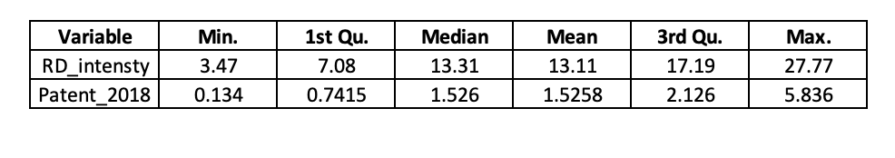

```{r setup, include=FALSE}
knitr::opts_chunk$set(echo = TRUE)
```
## introduction


## literature review


## Data

### Data collection
For the purpose of our project, we decided to use the [isiR package](https://github.com/warint/iriR), which is a package available in R, as our primary database. The isiR package provide the ranking of the top innovative companies, according to the European Commission’s Industrial R&D Investment Scoreboard, in addition to other dimensions. Those dimension include:Country, Year, Company’s name, Industry and Indicator. The indicator variable provides information such as sales, number of employees, profits, R&D spending and more. The secondary source used for data was from IPO's report on the [Top 300 Organizations Granted U.S Patent in 2018](https://ipo.org/wp-content/uploads/2019/07/Final_2018-Top-300.pdf).

### Dataset processing

 Since our project required very specific variable, it was necessary to perform some data 
processing before thinking of building models. Starting with the isiR database. The first step was to create a dataset in R using the isiR package with Rank, company's name, industry, year and R&D intensity as variable. It was decided as a group to limit our dataset to 30 observations. therefore, the filter function ,from the dplyr package, was used to limit the rank variable to 30 and make the year equal to 2019. This filtering helps us identify for which company the number of patent granted is need. With this thought in mind, and second dataset was created in R with company's name and patent as variables. Unfortunately, we were not able to find the number of patents granted in 2018 for 7  of the companies. in order to fill those missing data, we took the mean of the remaining 23 companies patents, the the entire row was divided by a 1000 for modeling purposes.


Once both datasets were completed, we combined them into a finish dataset. We then add two more variables named indicator and geographical location. The indicator variable only has 3 element; Top 10 for the company ranking between 1 and 10, Top 20 for those between 10 and 20 and finally Top 30 for the remaining companies.the geographical location categories companies into 3 location,Asia, Europe and North America, depending on their country code. With the final variables, our finished dataset has in total 11 variables; Rank in 2019, Company's name, Country code, Industry, R&D intensity, number of patent granted in 2018 and indicator as demonstrate in the table above. For this project indicator was determined as the dependent variable. Since the purpose of this project is to access whether R&D intensity and number of patents have a impact to the ranking, our models would mainly focus on those two as the sole independent variables. *(refer to table 1)*

{width=60%}

### Data analysis and visualization
Before starting the models, we decided to conduct some data analysis and data visualization, which may help understand our dataset better. As shown in figure 1, 15 out of the top 30 are located in North America, 1o in Europe and only 5 in Asia. Then, we made another second histogram using the country code to have a better visualization represented by figure 2.    

*Fig.1 Histogram for geographical location*


{width=60%}

*Fig.2 Histogram for country code*


{width=60%}

Using the function summary, in R, we were able to get the statistical description of both independent variables. As show in figure 3, R&D intensity has a min of 3.47 and a max of 27.77. Its first and third quartiles are 7.08 and 17.19. Lastly its mean is 13.11 while the median is 13.31. For number of patents granted, the min and max are 0.134 and 5.836 respectively. The first and third quartiles are 0.7415 and 2.126. the mean of paten is 1.5258, while the median is 1.526.


*Fig.3 Statistical Description of the Independent Variables*

{width=60%}

# Modeling

Since our depend variable only has 3 possible outcomes, we can conclude that a logistical regression would be the best than a linear regression to use. Additionally, outcomes are in a ordinal formation, Top 10 is better than Top 20 which in turn is better than Top 30. This ordinal formation narrows down our model options to an ordinal logistical regression.

  In an ordinal logistical regression, the output is the **Odds** of the a giving possible outcome as demonstrate in the following formula: 
 $$logit(P(Y<i))= \beta_0 + \beta_1.x_1+\beta_2.x_2+\beta_3.x_3+\epsilon$$
  
### Models creation
Using the mutate function, we gave the outcome of **Top 10** the value of 2, **Top 20** the value of 1 and **Top 30** the value of 0. This was a necessary step because it would help RStudio to directly know the right ordering (2 > 1 > 0) when creating the models.
To create the ordinal regression models, we used the **polr** function from the MASS package. 

our initial, thinking was to create 4 different model with the hope to capture any effects that may affect the dependent variable.Model 1 is a simple ordinal regression where: 
$P(indicator)= \beta_0 + \beta_1.R&D intensity+\beta_2.patent$
The second and third model were to test for quadratic effect on each independent variables individually as show in the following formulas: $P(indicator_i)= \beta_0 + \beta_1.(R&D intesity)^2+\alpha_2.(patents)$ 
and 
$P(indicator_i)= \beta_0 + \beta_1.(R&D intensity)+\beta_2.(patents)^2$.
For our final model, we wanted to test if there were any interaction effect and avoid multicollinearity: $P(indicator_i)= \beta_0 + \beta_1.(R&D intensity)+\beta_2.(patents)+\beta_3.(R&D intensity x patents)$ 
 

## Result
Since we are comparing non-nested models, we would use the AIC to determine which of the four model is the best for our research question. model 1, 2 and 3 have the same AIC of **67.8637** while model 4 has a AIC of **69.85396**. When comparing AIC, the model with the lowest number is considered the "best" model. In our case, we have 3 "best" models; model 1, model 2 and model 3. Since all 3 models are identical, it was decided to count them as one. 

Model 1 was taken as the best model. In order to interpret the result in a way that answer our question, we took the exponential of the coefficients of model 1. BY doing so, we would get the **odd** of the one of the outcome for a change in one of the independent variable. As a result we can conclude the following statements:

* For every one unit increase in R&D intensity, the odds of being in the upper rank  (top 10 or top 20  versus top 30) is multiplied 0.94 times, holding constant all other variables.
* For every one unit increase in patent, the odds of being in the upper rank (top 10 or top 20 versus top 30) is multiplied 2.06 times, holding constant all other variables.

## conclusion


